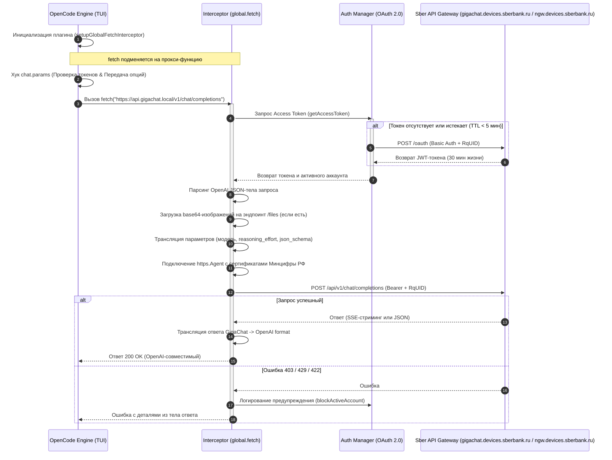

# Архитектура плагина OpenCode GigaChat

Этот документ описывает внутреннее устройство, жизненный цикл событий и техническую реализацию плагина интеграции OpenCode с GigaChat / GigaCode.

---

## 1. Схема взаимодействия (Event Lifecycle)

Плагин использует гибридную модель интеграции: он регистрирует хуки жизненного цикла событий OpenCode (`chat.params`, `chat.message`) и одновременно перехватывает глобальные сетевые запросы `fetch` на уровне среды выполнения Node.js для прозрачной трансляции протоколов OpenAI $\leftrightarrow$ GigaChat.



---

## 2. Глобальный перехватчик сети (Fetch Interceptor)

Поскольку OpenCode по умолчанию ожидает OpenAI-совместимый эндпоинт, плагин переопределяет глобальный метод `globalThis.fetch`.
*   **Виртуальный хост**: Запросы направляются на `https://api.gigachat.local/v1`. Перехватчик распознает этот домен и перенаправляет chat-трафик на legacy-совместимый эндпоинт `https://gigachat.devices.sberbank.ru/api/v1/chat/completions`, а файловые и служебные запросы - на `https://ngw.devices.sberbank.ru:9443/api/v2/...`.
*   **Строгая проверка хоста**: Перехватчик считает запрос GigaChat-запросом только если host входит в whitelist (`api.gigachat.local`, официальные хосты Сбера или зарегистрированный `baseURL`) либо если OpenCode добавил служебный заголовок `x-opencode-provider-marker`. Простое упоминание `api.gigachat.local` в query string или path не должно включать прокси-режим, иначе Bearer-токен можно случайно отправить на чужой домен.
*   **Консолидация и позиционирование системных сообщений (Fix 422)**: В API GigaChat действует строгое правило: *может быть только одно системное сообщение, и оно должно располагаться первым в списке (индекс 0)*. Плагин автоматически извлекает все входящие сообщения с ролями `system` и `developer` (OpenAI), объединяет их содержимое через перенос строки, дописывает к ним CoT-инструкции и помещает полученный промпт на позицию 0. Это исключает падения с ошибкой HTTP 422 при сложной истории или множественных системных директивах.
*   **Трансляция параметров рассуждения (CoT)**: Поскольку API GigaChat не имеет параметров `reasoning_effort` или `thinking` и возвращает ошибку HTTP 400 при их получении, перехватчик вырезает эти параметры из JSON и преобразует их в скрытые текстовые инструкции, прикрепляемые к системным сообщениям (системный промпт-инжиниринг). Это активирует встроенные CoT-механизмы модели `GigaChat-Max` без конфликта со схемой API.
*   **Потоковый парсинг (SSE)**: GigaChat возвращает стриминг в формате Server-Sent Events (SSE). Перехватчик разбирает входящий поток построчно, перепаковывает чанки из формата GigaChat в формат OpenAI (`chat.completion.chunk`) и отдает их OpenCode в реальном времени. Для потоковых `function_call` плагин держит стабильный `tool_call.id` на протяжении одного вызова и пробрасывает `functions_state_id`, чтобы следующий turn мог корректно продолжить tool roundtrip.

### 2.1. Выбор контракта GigaChat: legacy v1 сейчас, primary v2 позже

В `gigacode_temp` есть два рабочих слоя SDK:
* `gigachat.api.chat` / `gigachat.models.chat` - legacy-совместимый контракт: `messages`, `functions`, `function_call`, `functions_state_id`, SSE `data: ...`.
* `gigachat.api.chat_completions` / `gigachat.models.chat_completions` - primary v2 контракт: `messages[*].content[]`, `tools`, `tool_config`, `tools_state_id`, `model_options`, named SSE events.

Текущий плагин намеренно остается на legacy v1 chat contract, потому что вся OpenAI-совместимая трансляция уже построена вокруг `functions/function_call`. Поэтому `GIGACHAT_COMPLETIONS_URL` указывает на `https://gigachat.devices.sberbank.ru/api/v1/chat/completions`.

Не смешивай контракты частично. Если мигрировать плагин на primary v2, нужно менять весь транслятор целиком: request body, tool schema, tool result messages, response parsing и streaming parser. Простая замена URL на `/api/v2/chat/completions` сломает payload.

---

## 3. Авторизация и OAuth Менеджер

Класс `GigaCodeAuthManager` (в файле `src/gigacode/auth.ts`) управляет сессией и токеном единственного аккаунта:
*   **Динамическая конфигурация**: Учетные данные считываются динамически из настроек провайдера `provider.gigachat.options.credentials` в `opencode.json` при вызове хука `chat.params`. Если параметры не заданы в конфигурационном файле, плагин проверяет переменные окружения `GIGACHAT_CREDENTIALS` и `GIGACHAT_SCOPE` в качестве резервного источника.
*   **Превентивное обновление (Token Refresh)**: Токен GigaChat живет 30 минут. Плагин проверяет срок годности и обновляет токен за 5 минут до истечения (`REFRESH_BUFFER_SECONDS = 300`), предотвращая прерывание длинных сессий генерации.
*   **Семафоры и Promises**: Запрос токена кешируется в виде Promise. Если одновременно приходят несколько параллельных запросов к API, плагин делает только один сетевой запрос на получение токена OAuth, а остальные ждут разрешения этого же Promise.

---

## 4. Мультимодальность (Vision)

Когда пользователь прикрепляет изображение:
1. OpenCode передает его в массиве сообщений как base64-строку в формате: `data:image/png;base64,...`.
2. Плагин перехватывает этот массив в `translateOpenAiToGigaChat`.
3. Парсится MIME-тип изображения, формируется буфер данных.
4. Изображение загружается через `multipart/form-data` на эндпоинт `/api/v2/files` Сбера с использованием доверенных сертификатов Минцифры.
5. Сервер возвращает уникальный `file_id`.
6. Идентификатор загруженного файла (`file_id`) помещается в отдельный массив `attachments` на уровне сообщения, а текстовая часть передается в поле `content` в виде строки (в отличие от формата OpenAI, где вложения вкладываются в `content`).

---

## 5. Встроенный TLS Агент

Для работы со шлюзами Сбера требуется корневой сертификат Минцифры РФ.
Плагин использует кастомный `https.Agent`, настраиваемый динамически:
*   **Поиск сертификата в файловой системе**: Сначала плагин ищет сертификаты во внешней папке (`~/.config/opencode/certs/russian_trusted_root_ca.pem` или по пути переменной окружения `GIGACHAT_CA_BUNDLE_FILE`).
*   **Fallback на встроенный бандл**: Если внешние файлы не найдены, плагин подставляет экспортируемый из `src/gigacode/certs.ts` строковый массив `BUILTIN_CA_BUNDLE`, содержащий доверенные корневой и выпускающий сертификаты Минцифры РФ. Это избавляет пользователя от необходимости ручного импорта в операционную систему.
*   **Пофайловый разбор цепочки CA (PEM Splitting)**: В Node.js при передаче связки сертификатов (CA Bundle) в свойство `options.ca` в виде одной строки с несколькими сертификатами, среда выполнения Node.js парсит и доверяет только самому первому из них. Чтобы промежуточные выпускающие центры (например, `Russian Trusted Sub CA`) также считались доверенными, плагин использует функцию парсинга-разделения (`splitPemCerts`), которая разбивает бандл на массив отдельных PEM-строк. Это предотвращает ошибки `CERT_SIGNATURE_FAILURE` при построении полной цепочки доверия TLS.

---

## 6. Вызов функций и инструментов (Function / Tool Calling)

Поскольку OpenCode взаимодействует с моделями по протоколу OpenAI, он отправляет инструменты и ожидает ответы в формате OpenAI Tools. Однако шлюз GigaChat API не поддерживает спецификацию `tools` и ожидает работу с функциями по стандарту Function Calling. Плагин выполняет бесшовную двустороннюю трансляцию.

### 6.1. Маппинг и санитаризация имен функций (Исключение ошибок HTTP 400)
GigaChat предъявляет жесткие требования к именам функций: они должны содержать **только латинские буквы, цифры и знаки подчеркивания**, и не могут начинаться с цифры (регулярное выражение `^[a-zA-Z_][a-zA-Z0-9_]*$`), с ограничением по длине в 64 символа.

Поскольку OpenCode использует внешние MCP-серверы, имена инструментов часто содержат недопустимые символы (например, слэш `/` или дефис `-` в `dart-mcp-server/read_package_uris`). Передача таких имен в GigaChat API приводит к ошибке **HTTP 400 Bad Request**.

Для обхода этого ограничения плагин реализует прозрачный механизм подмены имен через псевдонимы (aliasing):
*   При отправке запроса ([translateOpenAiToGigaChat](file:///Users/overman/Desktop/GigaCode/opencode-gigachat-plugin/src/plugin/request.ts#L13)) каждое оригинальное имя инструмента регистрируется во внутреннем двустороннем реестре (`toolNameMap` и `originalToAliasMap`) и заменяется на безопасный псевдоним вида `tool_1`, `tool_2` и т.д.
*   При получении ответа от GigaChat (как в обычном режиме [translateGigaChatToOpenAi](file:///Users/overman/Desktop/GigaCode/opencode-gigachat-plugin/src/plugin/request.ts#L621), так и в потоковом SSE-режиме) псевдонимы декодируются обратно в оригинальные системные имена OpenCode.

### 6.2. Трансляция запроса (OpenAI $\leftrightarrow$ GigaChat)
При отправке запроса плагин преобразует параметры:
*   **Список инструментов**: параметр `tools` переформатируется из структуры OpenAI (где каждая функция обернута в объект `{ type: "function", function: { ... } }`) в плоский массив `functions`, ожидаемый GigaChat API. Имена заменяются на псевдонимы `tool_N`. Параметры без схемы нормализуются до `{ type: "object", properties: {} }`.
*   **Режим выбора**: параметр `tool_choice` транслируется в `function_call`. Строковые значения (`none`, `auto`) маппятся напрямую, а объект принудительного вызова конкретной функции (`{ type: "function", function: { name: "my_func" } }`) конвертируется в `{"name": "tool_N"}` с использованием псевдонима.
*   **История сообщений**:
    *   Сообщения с ролью `assistant`, содержащие вызовы инструментов (`tool_calls`), преобразуются: массив `tool_calls` заменяется на один объект `function_call` с псевдонимом вместо оригинального имени.
    *   Сообщения с ролью `tool` (результат выполнения инструмента на клиенте) переводятся в сообщения с ролью `function`, имя функции заменяется на псевдоним в поле `name`, а идентификатор вызова отбрасывается.

### 6.3. Трансляция ответа (GigaChat $\leftrightarrow$ OpenAI)
При получении ответа плагин конвертирует его обратно в формат OpenAI:
*   **Обычный ответ**: Если модель решает вызвать функцию, GigaChat возвращает `finish_reason: "function_call"` и объект `message.function_call`. Плагин декодирует псевдоним в оригинальное имя инструмента, генерирует уникальный случайный `call_id`, оборачивает вызов в массив `tool_calls` и изменяет `finish_reason` на `"tool_calls"`.
*   **Потоковый ответ (SSE-стриминг)**: GigaChat передает вызов функции (`delta.function_call`) в SSE-потоке. Парсер плагина декодирует псевдоним в оригинальное имя инструмента, формирует массив `tool_calls`, сохраняет один стабильный `call_id` для повторных чанков того же вызова и устанавливает `finish_reason` в `"tool_calls"`. Если в delta есть `functions_state_id`, он пробрасывается в OpenAI-совместимый delta-объект.


---

## 7. Критически важные ограничения GigaChat API

> [!CAUTION]
> Этот раздел обязателен к прочтению для всех, кто работает с трансляционным слоем плагина. Нарушение любого правила ниже приводит к HTTP 400 или к некорректной работе диалога с инструментами. Все правила подтверждены официальным Java SDK Сбера ([gigachat-java](https://github.com/ai-forever/gigachat-java)) и являются частью спецификации GigaChat API v1.

---

### 7.1. `function_call.arguments` — объект, а не строка

**Это главное отличие от OpenAI и главный источник ошибок HTTP 400.**

| Направление | Формат `arguments` |
|---|---|
| OpenAI -> плагин (входящий запрос) | JSON-**строка**: `"{\"location\":\"Moscow\"}"` |
| Плагин -> GigaChat (исходящий запрос) | JSON-**объект**: `{"location":"Moscow"}` |
| GigaChat -> плагин (ответ) | JSON-**объект**: `{"location":"Moscow"}` |
| Плагин -> OpenAI клиент (ответ) | JSON-**строка**: `"{\"location\":\"Moscow\"}"` |

**Правило:** При трансляции `OpenAI -> GigaChat` всегда парсить строку в объект через `parseArgumentsToObject()`. При трансляции `GigaChat -> OpenAI` всегда сериализовать объект в строку через `stringifyArguments()`. Никогда не передавать в GigaChat строку напрямую — это HTTP 400.

**Источник:** [`ChoiceMessageFunctionCall.java`](https://github.com/ai-forever/gigachat-java/blob/main/gigachat-java/src/main/java/chat/giga/model/completion/ChoiceMessageFunctionCall.java) — поле `arguments` объявлено как `Map<String, Object>`.

---

### 7.2. `response_format` несовместим с `functions`

GigaChat API **не поддерживает** одновременное использование `response_format` и `functions` в одном запросе. Если в запросе присутствует массив `functions`, параметр `response_format` нужно **полностью исключить** из тела запроса.

```
НЕПРАВИЛЬНО (HTTP 400):
{ "functions": [...], "response_format": { "type": "json_schema", ... } }

ПРАВИЛЬНО:
{ "functions": [...] }                      // без response_format
{ "response_format": { "type": "json" } }   // без functions
```

В коде: в `translateOpenAiToGigaChat` сначала обрабатываются инструменты. Если `hasTools === true`, блок `response_format` пропускается целиком.

---

### 7.3. Запрещённые поля в JSON-схеме параметров функций

GigaChat API отклоняет ряд стандартных полей JSON Schema, которые OpenAI и MCP-инструменты добавляют по умолчанию.

| Поле | Поведение |
|---|---|
| `additionalProperties` | Не поддерживается, HTTP 400 |
| `$schema` | Мета-поле JSON Schema, HTTP 400 |
| `nullable` | Не поддерживается в legacy function schema; используй `anyOf`/`oneOf`, HTTP 400 |

Все схемы параметров функций **обязательно** проходят через `sanitizeFunctionParameters()` — рекурсивную очистку перед отправкой.

> [!WARNING]
> OpenCode MCP-инструменты почти всегда добавляют `additionalProperties: false`. Без санитаризации **каждый** запрос с инструментами будет падать с HTTP 400.

---

### 7.4. `functions_state_id` — идентификатор сессии инструментов

GigaChat использует поле `functions_state_id` для связывания функциональных вызовов в рамках одного диалога. Поле возвращается в **ответах ассистента** при вызове функции и **должно передаваться обратно** в следующем шаге.

**Жизненный цикл:**

```
1. Клиент отправляет запрос с functions[]
2. GigaChat отвечает:
   { role: "assistant", function_call: {...}, functions_state_id: "abc-123" }
3. Клиент добавляет это сообщение в историю AS IS (вместе с functions_state_id)
4. Клиент добавляет результат вызова:
   { role: "function", name: "tool_1", content: "..." }
5. Клиент отправляет следующий запрос со всей историей
6. GigaChat видит functions_state_id и корректно продолжает цепочку
```

**Правило:** При трансляции `GigaChat -> OpenAI` поле `functions_state_id` сохраняется в объекте сообщения. При трансляции `OpenAI -> GigaChat` поле пробрасывается из входящей истории если присутствует.

**Источник:** [`ChatMessage.java`](https://github.com/ai-forever/gigachat-java/blob/main/gigachat-java/src/main/java/chat/giga/model/completion/ChatMessage.java) — аннотация `@JsonProperty("functions_state_id")`.

---

### 7.5. Ограничения системных сообщений

- Допускается **только одно** системное сообщение в `messages`.
- Системное сообщение **обязано быть первым** (индекс 0).
- Роль `developer` (OpenAI o-серия) трактуется как `system` — плагин маппирует автоматически.
- Несколько системных сообщений из OpenCode объединяются в одно через `\n`.

---

### 7.8. `content: null` vs `content: ""` — источник HTTP 422

**Это второе по частоте место ошибок после `arguments`.**

OpenAI при tool-вызовах посылает `"content": null` в assistant-сообщениях:
```json
{ "role": "assistant", "content": null, "tool_calls": [...] }
```

GigaChat **отклоняет пустую строку** `""` в этой позиции с HTTP 422. Он ожидает именно `null`.

| Тип сообщения | Значение `content` |
|---|---|
| `assistant` с `function_call` | `null` (не `""`) |
| `assistant` без вызова | `""` или текст ответа |
| `user` | Текст запроса |
| `function` (результат) | JSON-строка результата |

**Правило в коде:** Перед трансляцией вычисляется флаг `hasFunctionCall`. Если исходный `content` равен `null`/`undefined` и флаг поднят — в GigaChat уходит `null`. Если флаг не поднят — `""`.

> [!WARNING]
> Никогда не инициализируй `gigaMsg.content = ""` безусловно — это сломает все multi-turn диалоги с инструментами. Всегда проверяй наличие `tool_calls` / `function_call` в сообщении.

---

### 7.9. Разрешение имени функции из `tool_call_id` — ещё одна причина 422

В OpenAI API сообщения с результатом вызова инструмента (`role: "tool"`) **не содержат поля `name`**. Они идентифицируются только по `tool_call_id`:

```json
// OpenAI tool result — name отсутствует!
{ "role": "tool", "tool_call_id": "call_abc123", "content": "{\"temp\": 25}" }
```

Но GigaChat требует `name` (псевдоним функции) в сообщении с ролью `function`:
```json
// GigaChat — name обязателен!
{ "role": "function", "name": "tool_1", "content": "{\"temp\": 25}" }
```

**Решение:** Перед трансляцией истории строится `Map<tool_call_id, original_function_name>` из всех assistant-сообщений с `tool_calls`. Затем для каждого `tool` сообщения имя разрешается через этот мап:

```
toolCallIdToName = new Map()

for each msg in history:
  if msg.tool_calls:
    for each tc in msg.tool_calls:
      toolCallIdToName.set(tc.id, tc.function.name)

for each tool_msg in history:
  resolvedName = tool_msg.name OR toolCallIdToName.get(tool_msg.tool_call_id)
  gigaMsg.name = getToolAlias(resolvedName)
```

> [!CAUTION]
> Если `tool_call_id` не находится в мапе (например, история обрезана), сообщение уйдёт без `name`. GigaChat вернёт HTTP 422. При обрезке истории нельзя обрезать assistant-сообщение с `tool_calls`, не удалив соответствующий `tool`-ответ.

---

### 7.6. Строгий формат имён функций

- Допустимый формат: `^[a-zA-Z_][a-zA-Z0-9_]*$`
- Максимальная длина: **64 символа**
- Запрещены: `/`, `-`, `.`, `:`, пробел и любые спецсимволы

Все имена MCP-инструментов автоматически заменяются на псевдонимы `tool_N` перед отправкой и восстанавливаются в ответах (см. раздел 6.1).

---

### 7.7. Расширенные возможности: `few_shot_examples` и `return_parameters`

GigaChat поддерживает дополнительные поля объекта функции, которых нет в OpenAI:

- `few_shot_examples` — массив пар `{ request, params }` как примеры для модели. Улучшает точность генерации аргументов для нечётко описанных инструментов.
- `return_parameters` — JSON-схема возвращаемого значения функции. Помогает модели правильно интерпретировать результат.

Сейчас эти поля в трансляции не используются, но могут быть добавлены для повышения качества вызовов в будущих версиях.

**Источник:** [`ChatFunction.java`](https://github.com/ai-forever/gigachat-java/blob/main/gigachat-java/src/main/java/chat/giga/model/completion/ChatFunction.java).

---

### 7.10. Обязательная сериализация контента результатов функций (invalid function result json string)

**Это критическое отличие, вызывающее ошибку HTTP 422 при работе с инструментами.**

В отличие от OpenAI API, где результат выполнения функции (`content` в сообщении с ролью `tool`) может передаваться в виде любого текстового значения (включая неструктурированный текст, списки файлов через перенос строки или вывод консоли), шлюз GigaChat API **требует**, чтобы результат выполнения функции (`content` в сообщении с ролью `function`) был **строго валидной JSON-строкой**.

Если передать сырой неструктурированный текст, шлюз возвращает ошибку:
`status: 422, message: "Invalid params: invalid function result json string"`

**Решение в плагине:**
Перед отправкой истории сообщений плагин анализирует сообщения с ролями `tool`/`function`. Если содержимое `content` не парсится успешно через `JSON.parse()`, плагин автоматически преобразует его в валидную экранированную JSON-строку с помощью `JSON.stringify()`. Это гарантирует успешное прохождение валидации схемы в GigaChat API при работе с любыми стандартными MCP-инструментами OpenCode.
