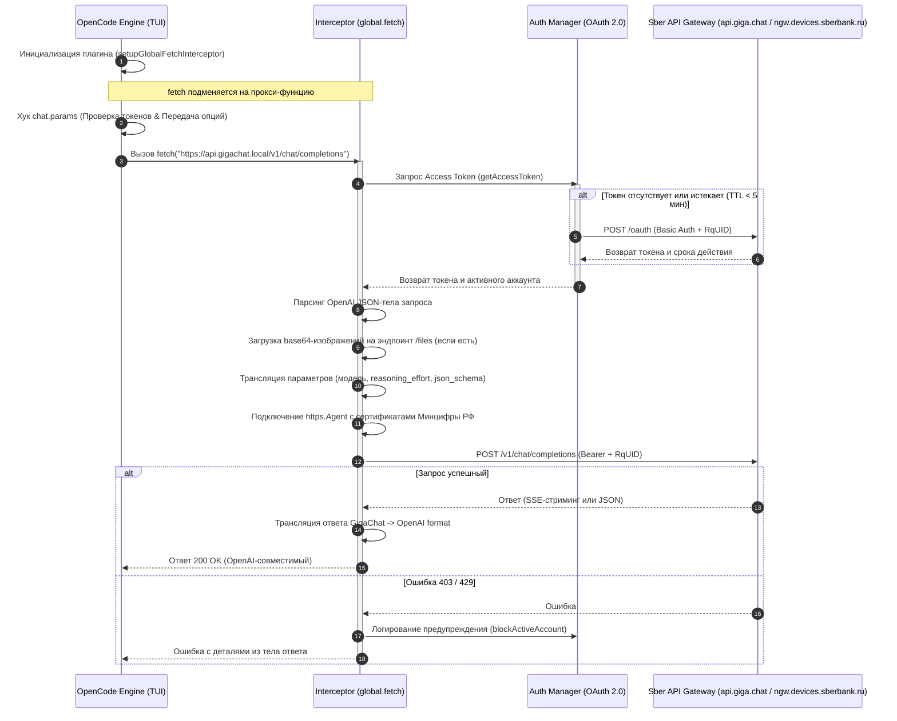

# Архитектура плагина GigaChat

Плагин преобразует запросы OpenCode в формат GigaChat API v1.
Он регистрирует хуки OpenCode и заменяет `globalThis.fetch` в процессе.

## Модули

`src/index.ts` экспортирует плагин для OpenCode.
`src/plugin.ts` создаёт менеджер авторизации, подключает перехватчик и возвращает хуки.

Пути в таблице указаны относительно `src/`.

| Модуль | Задача |
| --- | --- |
| `plugin/hooks.ts`, `plugin/auth-hooks.ts`, `plugin/provider.ts` | Хуки, сохранённые ключи, параметры провайдера и TLS |
| `plugin/interceptor.ts`, `plugin/routing.ts` | Выбор запросов, адреса и заголовки |
| `plugin/transport.ts`, `plugin/errors.ts` | HTTP-запросы и ошибки API |
| `plugin/translation.ts`, `plugin/messages.ts`, `plugin/tools.ts` | Параметры, история сообщений и вызовы функций |
| `plugin/responses.ts`, `plugin/stream.ts` | Обычные ответы и поток SSE |
| `plugin/attachments.ts`, `plugin/validation.ts` | Загрузка изображений и проверка размера текста |
| `gigacode/auth.ts`, `gigacode/certs.ts`, `gigacode/logger.ts` | Кэш токена, HTTPS-агенты и журнал |

`plugin/request.ts` сохраняет прежние экспорты. Их код находится в отдельных модулях.

## Сборка

| Команда | Результат |
| --- | --- |
| `npm run build` | Компилирует TypeScript в `dist/` |
| `npm run build:release` | Создаёт готовый `dist/gigachat-plugin.js` |
| `npm test` | Проверяет модули и хуки |
| `npm run test:release` | Проверяет готовый файл вне репозитория |

`dist/gigachat-plugin.js` содержит все модули и зависимости в одном файле.
Сборщик сохраняет читаемый код без минификации.
Заголовок файла указывает на исходники и путь установки.
В конце файла находятся лицензии проекта и включённых зависимостей.

Пользователь копирует готовый файл в `~/.config/opencode/plugins/`.
OpenCode загружает этот файл при запуске.
Исходные модули остаются в `src/` для разработки.

Для разработки изменяйте `src/`. Сборка и обновление заменяют готовые файлы.

Проверка релиза использует локальный HTTP-сервер и тестовые ключи.
Она проверяет OAuth, кэш, текст, модели, вызов инструмента с результатом, SSE, загрузку файлов, отмену запросов и ошибки API.
Загрузка файлов проверяется для публичного и корпоративного адресов.
Проверка копирует только готовый файл в отдельную папку без npm-зависимостей.
Она также проверяет номер версии, лицензии и отсутствие прежнего ZIP-артефакта.
Эти тесты не подтверждают доступность API Сбера или права корпоративного аккаунта.

## Путь запроса



Хук `chat.params` применяет параметры провайдера и получает токен.
Хук `chat.message` проверяет размер текстовых частей.
Перехватчик преобразует сетевой запрос и возвращает ответ в формате OpenAI.

## Выбор адреса и контракта

Виртуальный адрес: `https://api.gigachat.local/v1`.
Публичный адрес: `https://api.giga.chat/v1`.
OAuth использует `https://ngw.devices.sberbank.ru:9443/api/v2/oauth`.

Перехватчик принимает запрос, если его хост зарегистрирован или запрос содержит служебный заголовок `x-opencode-provider-marker`.
В список входят виртуальный хост, официальные хосты Сбера и хост из `baseURL`.
Упоминание GigaChat в пути или параметрах постороннего URL не включает перехват.

При смене виртуального адреса плагин сохраняет путь и параметры URL.
Старый хост `gigachat.devices.sberbank.ru` также распознаётся.
Адреса описаны в [справке Сбера](https://developers.sber.ru/docs/ru/gigachat/api/reference/rest/gigachat-api).

Контракты v1 и v2 имеют разные поля:

| Контракт | Поля |
| --- | --- |
| v1, используется плагином | `messages`, `functions`, `function_call`, `functions_state_id` |
| v2 | `messages[*].content[]`, `tools`, `tool_config`, `tools_state_id`, `model_options` |

v1 использует SSE со строками `data:`. v2 также использует именованные события.
Если переходите на v2, измените тело запроса, схемы инструментов, сообщения результатов, ответы и обработку потока.
Замена одного URL не переводит плагин на другой контракт.

## Авторизация

`GigaCodeAuthManager` управляет одним аккаунтом.
Ключ и scope поступают через `auth.loader`, параметры провайдера или переменные окружения.
Хук `chat.params` применяет `provider["GigaChat (Sberbank)"].options`.

Менеджер хранит токен и время истечения, которое вернул сервер.
Обычный срок токена составляет 30 минут.
Если до истечения осталось меньше 5 минут, следующий запрос обновляет токен.
Порог в коде: `REFRESH_BUFFER_SECONDS = 300`.

Несколько запросов ждут один Promise обновления.
При смене ключа, scope или параметров TLS менеджер сбрасывает кэш.
Ответ старого OAuth-запроса не может заменить токен новой конфигурации.

`blockActiveAccount()` выводит предупреждение при HTTP 403 или 429.
Он не переключает аккаунт автоматически.

## Сертификаты TLS

`getHttpsAgent()` создаёт `https.Agent` для OAuth, запросов API и загрузки файлов.
Агент использует `keepAlive: true` и кэшируется для повторных запросов.
Проверка сертификатов включена по умолчанию.

Плагин читает внешний PEM-бандл по настроенному пути.
Путь по умолчанию: `~/.config/opencode/certs/russian_trusted_root_ca.pem`.
Если файла нет, плагин использует `BUILTIN_CA_BUNDLE` из `gigacode/certs.ts`.
Бандл содержит корневой и выпускающий сертификаты Минцифры.

`splitPemCerts()` разделяет бандл на отдельные PEM-сертификаты для параметра `ca`.
Это описывает формат передачи сертификатов агенту; устанавливать их в ОС для работы плагина не требуется.

## Изображения

Плагин принимает изображение в `content` как `data:image/png;base64,...`.
Дальше он выполняет действия:

1. Читает MIME-тип и декодирует Base64 в буфер.
2. Создаёт тело `multipart/form-data` с полями `file` и `purpose`.
3. Отправляет файл на `/files` того же базового адреса, что и запрос модели.
4. Читает идентификатор из поля `id` ответа.
5. Добавляет идентификатор в `attachments` сообщения.
6. Отправляет текст сообщения в строковом поле `content`.

При ошибке загрузки плагин возвращает ошибку. Он не отправляет запрос модели без изображения.

## Вызовы инструментов

### Имена функций

Формат имени функции API v1: `^[a-zA-Z_][a-zA-Z0-9_]*$`.
Максимальная длина: 64 символа.
Символы `/`, `-`, `.`, `:`, пробелы и другие специальные символы не подходят.

MCP-имя `dart-mcp-server/read_package_uris` содержит `/` и `-`.
Плагин заменяет каждое имя на псевдоним `tool_1`, `tool_2` и далее.
При ответе он восстанавливает исходное имя.

Пары хранятся в `toolNameMap` и `originalToAliasMap`.
Преобразование выполняют `getToolAlias()` и `getOriginalToolName()`.

### Формат запроса

| Поле OpenAI | Поле GigaChat |
| --- | --- |
| `tools[].function` | `functions[]` |
| `tool_choice: "none"` или `"auto"` | То же значение в `function_call` |
| Выбор функции по имени | `function_call: { "name": "tool_N" }` |
| `assistant.tool_calls` | Один объект `assistant.function_call` |
| Сообщение `tool` | Сообщение `function` с именем функции |

Если схема параметров отсутствует, плагин использует `{ "type": "object", "properties": {} }`.

### Аргументы функции

| Направление | Формат `arguments` |
| --- | --- |
| OpenAI в плагин | JSON-строка: `"{\"location\":\"Moscow\"}"` |
| Плагин в GigaChat | Объект: `{"location":"Moscow"}` |
| GigaChat в плагин | Объект: `{"location":"Moscow"}` |
| Плагин в клиент | JSON-строка: `"{\"location\":\"Moscow\"}"` |

При отправке в GigaChat используйте `parseArgumentsToObject()`.
При ответе клиенту используйте `stringifyArguments()`.
Передача строки вместо объекта в GigaChat может вызвать HTTP 400.

Тип `Map<String, Object>` указан в [ChoiceMessageFunctionCall.java](https://github.com/ai-forever/gigachat-java/blob/main/gigachat-java/src/main/java/chat/giga/model/completion/ChoiceMessageFunctionCall.java).

### JSON-схема и формат ответа

`sanitizeFunctionParameters()` рекурсивно удаляет поля, которые не поддерживает схема функций v1:

| Поле | Действие |
| --- | --- |
| `additionalProperties` | Удаляется |
| `$schema` | Удаляется |
| `nullable` | Удаляется; для альтернатив типов используйте `anyOf` или `oneOf` |

MCP-инструменты могут передавать `additionalProperties: false`.
Схему нужно очистить перед отправкой в GigaChat.

Если запрос содержит функции, исключите `response_format`.
Плагин обрабатывает инструменты первым и пропускает формат ответа при `hasTools === true`.
Для запроса без функций можно использовать `response_format: { "type": "json" }`.

### Системные сообщения

Сообщение `system` может быть только одно и должно стоять первым.
Плагин объединяет тексты `system` и `developer` через `\n`.
Он добавляет инструкцию рассуждения к этому сообщению.
Поля `reasoning_effort` и `thinking` не отправляются в тело API v1.

### Содержимое вызова и результата

При вызове функции сохраните `content: null` в сообщении `assistant`.
Пустая строка в этой позиции может вызвать HTTP 422.

| Сообщение | Значение `content` |
| --- | --- |
| `assistant` с вызовом функции | `null` |
| `assistant` без вызова | Текст или пустая строка |
| `user` | Текст запроса |
| `function` | JSON результата |

В `messages.ts` флаг `hasFunctionCall` определяет обработку `null`, `undefined` и пустой строки.
Не задавайте `gigaMsg.content = ""` без проверки вызова функции.

Результат функции должен содержать JSON.
Если `JSON.parse()` не принимает текст результата, плагин преобразует его через `JSON.stringify()`.
Он сохраняет JSON без повторного кодирования.
Неверный результат может вызвать HTTP 422 с сообщением `invalid function result json string`.

### Имя результата функции

OpenAI связывает результат с вызовом через `tool_call_id`.
GigaChat требует имя функции в поле `name`.

OpenAI:

```json
{ "role": "tool", "tool_call_id": "call_abc123", "content": "{\"temp\": 25}" }
```

GigaChat:

```json
{ "role": "function", "name": "tool_1", "content": "{\"temp\": 25}" }
```

Перед преобразованием истории плагин собирает соответствия `tool_call_id` и имени из сообщений `assistant.tool_calls`.
Он использует `msg.name`, если имя уже задано. Иначе он ищет имя по `tool_call_id`.
Затем он заменяет имя на псевдоним.

Если обрезаете историю, сохраняйте вызов вместе с результатом или удаляйте оба сообщения.
Результат без исходного вызова может остаться без имени и вызвать HTTP 422.

### Состояние вызовов

`functions_state_id` связывает вызовы функций в диалоге.
Плагин сохраняет это поле в ответе ассистента и передаёт его из следующей входящей истории, если поле есть.

Последовательность:

1. Клиент отправляет запрос с `functions`.
2. GigaChat возвращает `assistant.function_call` и `functions_state_id`.
3. Клиент сохраняет сообщение ассистента вместе с идентификатором состояния.
4. Клиент добавляет результат `function` с `name` и JSON в `content`.
5. Клиент отправляет всю историю в следующем запросе.

Поле описано в [ChatMessage.java](https://github.com/ai-forever/gigachat-java/blob/main/gigachat-java/src/main/java/chat/giga/model/completion/ChatMessage.java).

### Ответ модели

Плагин заменяет `message.function_call` на `message.tool_calls` и восстанавливает исходное имя инструмента.
Он создаёт идентификатор вызова и заменяет `finish_reason: "function_call"` на `"tool_calls"`.

В SSE плагин преобразует `delta.function_call` в `delta.tool_calls`.
Он сохраняет идентификатор для частей одного вызова.
`finish_reason` отмечает завершение на финальной части ответа.
Поле `functions_state_id` сохраняется в `delta`, если оно есть.

### Дополнительные поля GigaChat

| Поле функции | Назначение |
| --- | --- |
| `few_shot_examples` | Примеры пар `{ request, params }` |
| `return_parameters` | JSON-схема результата функции |

Эти поля описаны в [ChatFunction.java](https://github.com/ai-forever/gigachat-java/blob/main/gigachat-java/src/main/java/chat/giga/model/completion/ChatFunction.java).
Плагин пока не использует их при преобразовании.
Их можно добавить в будущей версии для работы с примерами и схемой результата.
