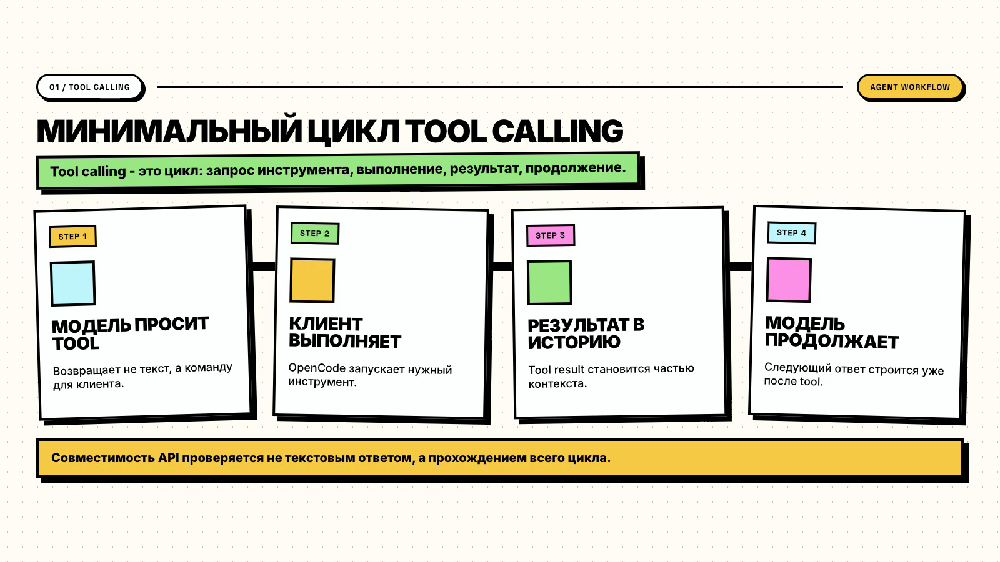
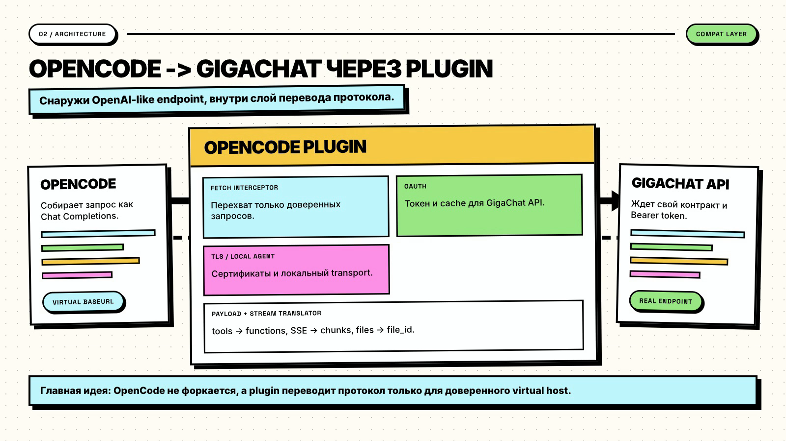
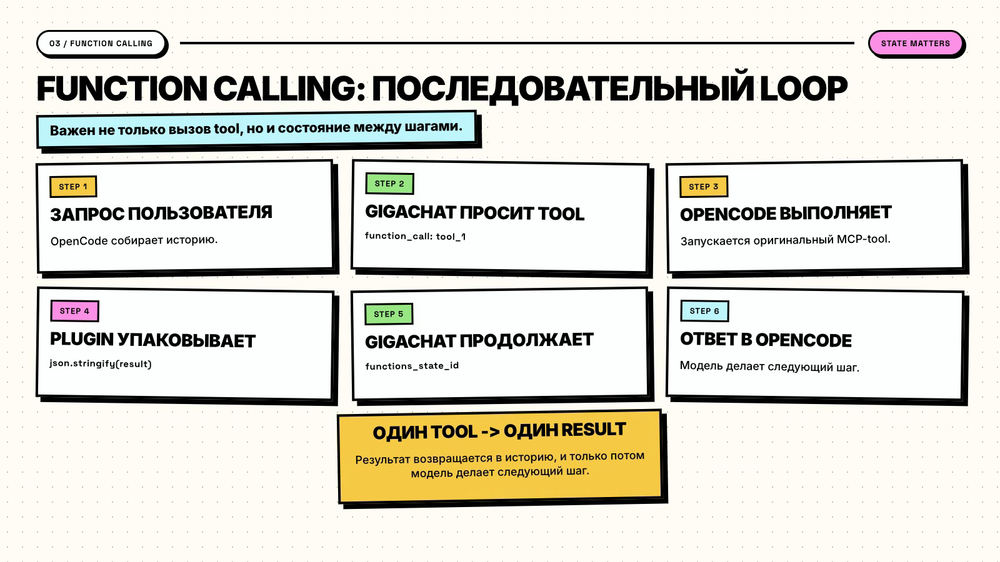

# Как я подключил GigaChat к OpenCode

Это копия статьи о личном инженерном эксперименте.
Инструкция установки находится в [README](../README.md).

Мне интересна разработка с помощью агентов. Я хотел проверить российские модели GigaChat / GigaCode в работе с кодом.
Для проверки я выбрал OpenCode и написал TypeScript-плагин.

Обычный чат получает запрос и возвращает текст.
В агентном сценарии модель также читает историю, вызывает инструменты и получает результаты.
Она может работать с изображениями и передавать ответ потоком.
Именно такой сценарий я хотел проверить в реальном проекте.

Я делал исследовательский прототип без команды и коммерческих планов.
Долгую поддержку репозитория я не планировал.
Сначала я хотел подключить модели и посмотреть на результат. Масштаб преобразования протоколов выяснился в процессе.

Текстовый запрос заработал быстро: я получил токен, отправил `messages` и получил ответ.
Для инструментов, истории, потока и изображений пришлось написать отдельные преобразования.

Репозиторий: [Overman775/opencode-gigachat-plugin](https://github.com/Overman775/opencode-gigachat-plugin).

## Почему я выбрал OpenCode

У OpenCode открытые исходники. Я мог посмотреть, где он собирает запрос и подключает провайдеров.
Это помогло найти место для плагина без форка проекта.

OpenCode работает с файлами, инструментами и историей внутри проекта.
У него есть другие провайдеры и инструменты. Поэтому он подходил для проверки модели при работе с кодом.

У меня уже был положительный опыт работы с OpenCode.
Я мог проверять новую модель в знакомой среде.

Я хотел сравнить поведение моделей при работе с кодом, контекстом и инструментами.
Исследование несовместимости API не было первоначальным планом.
Плагин служил инструментом этой проверки. Я не собирался создавать ещё один SDK.

## Похожие API и цикл инструмента

Сначала я надеялся, что достаточно заменить `baseURL` и подставить ключ.
Для простого чата подключение выглядит примерно так.
Агенту также нужен полный цикл вызова инструмента:



OpenCode отправляет запрос в формате OpenAI.
GigaChat API v1 требует другой формат для части полей:

- `tools` преобразуется в `functions`;
- `tool_calls` преобразуется в `function_call`;
- аргументы функции передаются объектом;
- результат функции должен содержать JSON;
- системное сообщение должно быть единственным и первым;
- изображение нужно сначала загрузить через `/files`;
- `functions_state_id` связывает продолжение вызовов инструментов.

После этих проверок плагин стал преобразовывать протокол.

## Проверка через cURL

Я начал с cURL, чтобы проверить API отдельно от OpenCode.
Сначала получил токен OAuth:

```bash
curl -L -X POST 'https://ngw.devices.sberbank.ru:9443/api/v2/oauth' \
  -H 'Content-Type: application/x-www-form-urlencoded' \
  -H 'Accept: application/json' \
  -H "RqUID: $(uuidgen)" \
  -H 'Authorization: Basic <BASE64_CLIENT_ID_AND_SECRET>' \
  --data-urlencode 'scope=GIGACHAT_API_PERS'
```

Затем отправил текстовый запрос. В эксперименте я использовал прежний адрес API:

```bash
curl -L -X POST 'https://gigachat.devices.sberbank.ru/api/v1/chat/completions' \
  -H 'Content-Type: application/json' \
  -H 'Accept: application/json' \
  -H "Authorization: Bearer $TOKEN" \
  --data-raw '{
    "model": "GigaChat-2",
    "messages": [
      { "role": "user", "content": "Привет! Назови своё имя." }
    ],
    "max_tokens": 100
  }'
```

Токен пришёл, модель ответила.
Когда запросы из OpenCode возвращали HTTP 400 или 422, я повторял проверку вручную.
Так я мог отделить ошибку своего запроса от требований API.

Правила переходили в код после проверки: запрос через cURL, преобразование в TypeScript, затем тест.
Поэтому часть преобразований в плагине появилась после конкретных ошибок API.

## OAuth и сертификаты

GigaChat выдаёт временный `access_token` для заголовка `Authorization: Bearer ...`.
Обычный срок токена составляет 30 минут. Сессия агента может длиться дольше.

Я добавил менеджер авторизации, который:

- читает ключ из `opencode.json` или переменных окружения;
- получает токен через `/api/v2/oauth`;
- хранит токен в кэше;
- обновляет токен при запросе за 5 минут до истечения;
- объединяет одновременные обновления в один OAuth-запрос.

Это позволяет нескольким запросам ждать один результат авторизации.

Для первого теста cURL можно использовать `-k`.
Для плагина я выбрал отдельный `https.Agent` с сертификатами.
Он обслуживает GigaChat, OAuth и `/files`.
Проверку TLS для всего процесса я не отключал.

## Перехватчик внутри плагина

Другой вариант: отдельный прокси между OpenCode и GigaChat.
OpenCode обращается к нему в формате OpenAI, а прокси преобразует запросы.
Для большого решения такой подход подходит. В своём эксперименте я не хотел поддерживать дополнительный сервис.

Внутреннее устройство OpenCode я сначала знал плохо.
Я читал исходники и конфиги, запускал запросы и проверял их адреса.
После нескольких попыток я выбрал сетевой слой.

При запуске плагин заменяет `globalThis.fetch`.
Конфиг задаёт виртуальный `baseURL`: `https://api.gigachat.local/v1`.
Плагин получает токен, преобразует запрос для GigaChat и преобразует ответ обратно.



Я пришёл к этому решению через несколько проверок и исправлений.
Перехват также нужно было ограничить.
Плагин принимает известный хост или служебный заголовок. Одного упоминания GigaChat внутри URL недостаточно.
Иначе токен мог бы попасть на посторонний адрес.

## Форматы инструментов

OpenCode может отправить такой запрос:

```json
{
  "tools": [
    {
      "type": "function",
      "function": {
        "name": "dart-mcp-server/read_package_uris",
        "parameters": {
          "type": "object",
          "additionalProperties": false
        }
      }
    }
  ],
  "tool_choice": "auto"
}
```

GigaChat v1 ожидает другой формат:

```json
{
  "functions": [
    {
      "name": "tool_1",
      "description": "...",
      "parameters": {
        "type": "object",
        "properties": {}
      }
    }
  ],
  "function_call": "auto"
}
```

В истории OpenCode может быть несколько сообщений `system` и `developer`.
Плагин объединяет их через перенос строки в одно сообщение `system` на позиции `0`.
Иначе запрос может вернуть `422 Unprocessable Entity`.

Имена MCP-инструментов могут содержать символы, которые GigaChat не принимает:

```text
dart-mcp-server/read_package_uris
```

GigaChat требует латинские буквы, цифры и подчёркивания. Имя не должно начинаться с цифры.
Плагин отправляет псевдоним `tool_1` и восстанавливает исходное имя в ответе.

OpenAI может передать аргументы как JSON-строку:

```json
{ "arguments": "{\"location\":\"Moscow\"}" }
```

GigaChat ожидает объект:

```json
{ "arguments": { "location": "Moscow" } }
```

Преобразование нужно в обоих направлениях.
GigaChat возвращает объект, а OpenAI-клиент ожидает строку.
Я пришёл к этому правилу после ошибок запросов и сравнения примеров и SDK.

Репозиторий [ai-forever/gigachat](https://github.com/ai-forever/gigachat) помог разобраться в сообщениях, вызовах функций и потоке.
Его статус я точно не определил: официальный SDK, близкий к официальному или основной SDK GigaChain.
Для практической проверки он был полезен.

Результат инструмента тоже требует преобразования.
OpenCode может вернуть обычный текст команды или файла.
GigaChat требует JSON в сообщении `function`.
Я добавил `JSON.stringify()`, чтобы убрать ошибку `invalid function result json string`.

Ещё один случай: `content: null` при вызове функции.
При замене `null` пустой строкой GigaChat мог вернуть HTTP 422.
Эти изменения небольшие по отдельности, но вместе они составляют слой совместимости.

## Состояние вызова

В агентном сценарии модель вызывает инструмент, клиент выполняет его и возвращает результат.
Для продолжения этого диалога GigaChat использует `functions_state_id`.
Плагин сохраняет идентификатор и передаёт его в следующей истории, если поле сохранил клиент.

Я проверял последовательный цикл: вызов, результат, следующий шаг.
Агент может захотеть прочитать файл, проверить конфиг и запустить тесты.
Для GigaChat в этом контракте вызовы нужно выполнять последовательно.



Такой цикл менее свободен и может быть медленнее параллельного.
Для эксперимента это был приемлемый компромисс.
Я хотел проверить всю цепочку и сохранить состояние между шагами.

## Другие преобразования

После работы с `messages` и `functions` оставались другие различия формата.

Схемы инструментов OpenAI и MCP могут содержать `additionalProperties`, `$schema` и `nullable`.
Схема функций GigaChat v1 принимает не все эти поля.
Я добавил очистку схемы перед отправкой.

Параметры `reasoning_effort` и `thinking` я преобразовал в системную инструкцию.
Я не отправлял их отдельными полями API v1.
Для проверки идеи хватило инструкции с выбранным уровнем подробности.
Она не заменяет отдельный механизм управления бюджетом рассуждений.

Поток GigaChat тоже нужно преобразовывать.
Плагин читает SSE-события `data: ...` и заменяет `delta.function_call` на `delta.tool_calls`.
Для одного вызова он сохраняет один `tool_call.id`.

Изображение OpenAI может передать как Base64 в `content`.
GigaChat требует сначала загрузить файл через `/v1/files`.
После загрузки плагин добавляет `file_id` в `attachments` и отправляет запрос модели.

## Что показала отладка

Простые текстовые запросы работали.
Сценарии с инструментами, MCP, потоком, изображениями и историей требовали преобразования API.

Я отправлял запрос, получал 400 или 422, сужал проблему и сравнивал формат с примерами.
После этого я исправлял преобразование.
Так я выяснял, где API принимает похожую структуру, а где требует свой формат.

Результат зависел от модели и от того, как клиент передавал запрос и историю.

## Личные оценки моделей

Я пробовал разные модели в OpenCode и смотрел на ответы в работе.
Строгого набора задач, таблиц и измерений процентов у меня не было.
Это личные наблюдения, а не результаты бенчмарка.

По моим ощущениям, качество менялось от «примерно уровень старого GPT-3.5» до «местами похоже на GPT-4o».
На простых задачах, объяснениях, небольших правках кода и русском тексте результаты выглядели живыми.
В сложных агентных сценариях мешали ошибки вызовов, потеря состояния и неподходящие схемы.

Модели мне интересны, но в агентной среде я также оцениваю работу API и инструментов.
Ответ модели, вызовы функций и поток должны работать вместе предсказуемо.

GigaChat-3.1 я не проверил.
Через Sber Studio, личный кабинет технологических продуктов Сбера, мне были доступны модели первого и второго поколения.
GigaChat-3.1 не было в списке выбора для моего сценария.
Локальный запуск этих моделей в эксперименте тоже не получился.

В посте Сбера про 3.1 описаны улучшения рассуждений и вызовов функций.
Поэтому мне хотелось бы проверить эту модель с инструментами.
Если улучшения проявятся в API-сценариях с инструментами, результат может быть заметно лучше, чем у моделей, которые я уже проверял.

## Результат эксперимента

Я начинал с проверки российских моделей в агентной среде разработки.
В процессе я также получил список различий между API OpenAI и GigaChat.

Плагин преобразует запрос, получает OAuth-токен и возвращает ответ в формате клиента.
Для потока, инструментов и изображений он выполняет дополнительные действия.
Он сохраняет `functions_state_id`, заменяет имена, очищает схемы, сохраняет `null` и загружает файлы.

С GigaChat можно экспериментировать в OpenCode.
Для прямого подключения этого API нужен слой, который учитывает различия форматов.
Без него ошибки контракта мешают оценить качество самой модели.

## Пожелание к платформе

Мне нужен понятный официальный контракт для таких подключений.
Агенты разработки, MCP-клиенты и плагины IDE часто ожидают поведение API OpenAI.

Для подключения помог бы совместимый режим или подробная OpenAPI-спецификация.
В ней нужны форматы сообщений, инструментов, результатов, потоков, вложений и состояния вызовов.

Тогда требования к `arguments`, `content: null`, `functions_state_id` и JSON результата будут видны до отправки запроса.
Разработчики смогут подключать модель к инструментам без собственного преобразования протокола.

## Ссылки

- [Плагины OpenCode](https://opencode.ai/docs/ru/plugins/)
- [Sber Studio](https://developers.sber.ru/studio/)
- [Вызов функций GigaChat](https://developers.sber.ru/docs/ru/gigachat/guides/functions/overview)
- [ai-forever/gigachat](https://github.com/ai-forever/gigachat)
- [Пост Сбера про GigaChat-3.1](https://habr.com/ru/companies/sberbank/articles/1014146/)
- [Опыт работы с вызовом функций GigaChat](https://habr.com/ru/articles/806627/)
- [Опыт подключения GigaChat к пет-проекту](https://habr.com/ru/articles/1009650/)
